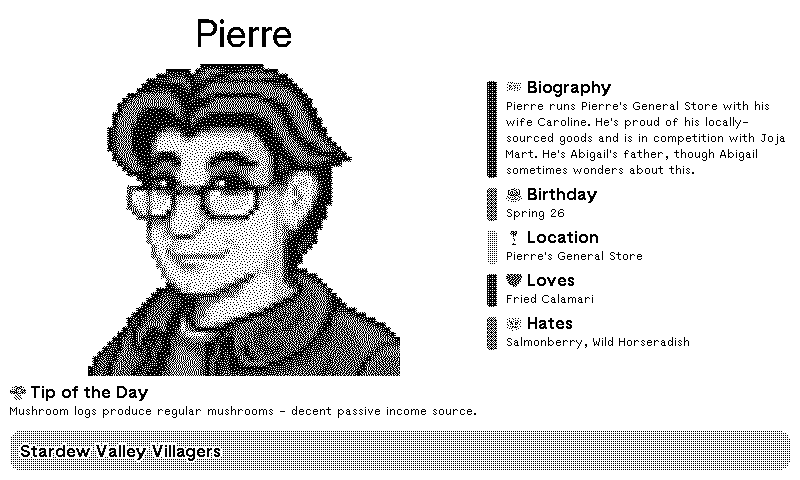

# tmrnl-stardew-valley-villagers-plugin
This repository contains the plugin-data for the TRMNL Stardew Valley Villagers plugin.

You can also report any issues with the plugin here.

This plugin was created as a fun little way for my kids who love Stardew Valley learn more about the villagers.

<!-- PLUGIN_STATS_START -->
## 🚀 TRMNL Plugin(s)

*Last updated: 2025-12-26 06:39:33 UTC*

##  [Stardew Valley Villagers](https://usetrmnl.com/recipes/160532)

### Description
Displays a random villager from the Stardew Valley game with their biography, location, birthday, loved and hated gifts and a "tip of the day" for the game Stardew Valley.

### 📊 Statistics

| Metric | Value |
|--------|-------|
| Installs | 1 |
| Forks | 9 |

---

<!-- PLUGIN_STATS_END -->